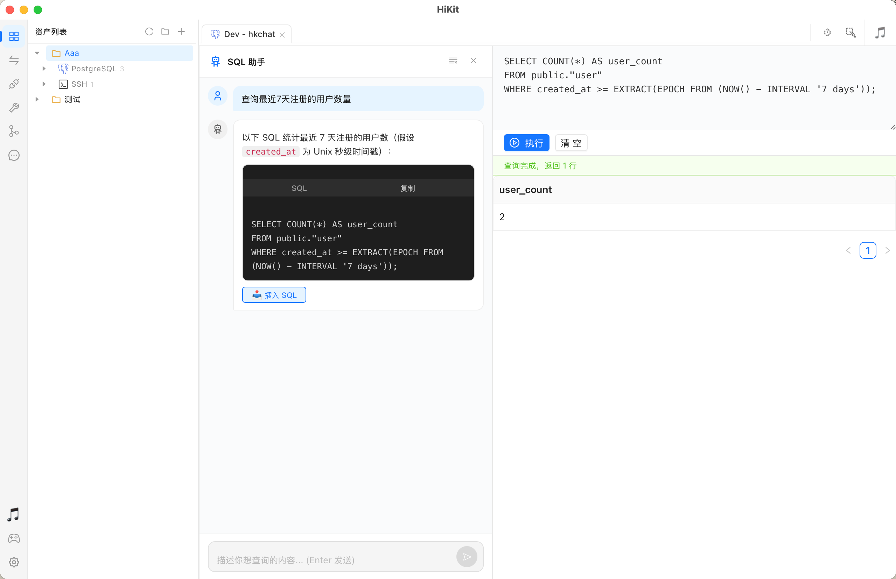

# HiKit

> Una caja de herramientas de escritorio todo en uno para desarrolladores, construida con **Wails + React + Go**

[](../../LICENSE)
[](https://wails.io)

[English](../../README.md) | [简体中文](README_zh.md) | [繁體中文](README_zh-TW.md) | [日本語](README_ja.md) | [한국어](README_ko.md) | Español | [Deutsch](README_de.md) | [Français](README_fr.md) | [Português](README_pt.md)

---

## Módulos

| Módulo | Descripción |
|--------|-------------|
| 🖥️ **SSH / SFTP** | Terminal remoto & gestor de archivos |
| 🔀 **Reenv. de Puertos SSH** | Túnel SSH local/remoto |
| 🗄️ **Base de Datos** | Redis · MySQL · MariaDB · PostgreSQL · SQLite · SQL Server · ClickHouse · Oracle |
| 🌐 **REST Client** | Depuración HTTP con soporte de archivos `.http` |
| 🕵️ **Proxy Web** | Proxy HTTP/SOCKS + captura + manipulación MITM |
| 💻 **Terminal Local** | Shell local integrado |
| 🔧 **Caja de Herramientas** | JSON, JWT, Hash, Regex, Diff, UUID, QR Code... 17 herramientas |
| 📋 **Tareas** | Gestión ligera de tareas |
| 📝 **Notas** | Editor Markdown con vista previa en tiempo real |
| 📦 **Git** | Gestión visual de repositorios locales |
| 🎵 **Reproductor** | Búsqueda en línea + sincronización de letras |
| 🎮 **Emulador** | Juegos clásicos FC / SFC / NEO GEO |
| 🔐 **Bóveda** | Gestión de credenciales seguras (próximamente)|

---

## Vista Previa

### Nueva Conexión


---

### Base de Datos

<table>
  <tr>
    <td></td>
    <td></td>
  </tr>
  <tr>
    <td align="center">Explorador de tablas</td>
    <td align="center">Resultados SQL</td>
  </tr>
</table>



---

### SSH / SFTP & Proxy Web

<table>
  <tr>
    <td></td>
    <td></td>
  </tr>
  <tr>
    <td align="center">SSH &amp; SFTP</td>
    <td align="center">Proxy Web + MITM</td>
  </tr>
</table>

---

<details>
<summary>📸 Más capturas de pantalla</summary>

### Reenvío de Puertos SSH


### REST Client


### Caja de Herramientas


### Git


### Tareas & Notas
<table>
  <tr>
    <td></td>
    <td></td>
  </tr>
</table>

### Reproductor & Emulador
<table>
  <tr>
    <td></td>
    <td></td>
  </tr>
</table>

</details>

---

## Desarrollo

```bash
wails dev    # Modo desarrollo
wails build  # Compilar
```

---

## Stack Tecnológico

| Capa | Tecnología |
|------|------------|
| **Backend** | Go + Wails v2 |
| **Frontend** | React + TypeScript + Ant Design |
| **Base de datos** | SQLite |
| **Terminal** | xterm.js |
