# HiKit

> **Wails + React + Go** 로 개발된 개발자를 위한 올인원 데스크톱 툴박스

[](../../LICENSE)
[](https://wails.io)

[English](../../README.md) | [简体中文](README_zh.md) | [繁體中文](README_zh-TW.md) | [日本語](README_ja.md) | 한국어 | [Español](README_es.md) | [Deutsch](README_de.md) | [Français](README_fr.md) | [Português](README_pt.md)

---

## 기능 목록

| 모듈 | 설명 |
|------|------|
| 🖥️ **SSH / SFTP** | 원격 터미널 & 파일 관리 |
| 🔀 **SSH 포트 포워딩** | 로컬/원격 SSH 터널 |
| 🗄️ **데이터베이스** | Redis · MySQL · MariaDB · PostgreSQL · SQLite · SQL Server · ClickHouse · Oracle |
| 🌐 **REST Client** | `.http` 파일 형식 지원 HTTP 디버깅 |
| 🕵️ **웹 프록시** | HTTP/SOCKS 프록시 + 패킷 캡처 + MITM 변조 |
| 💻 **로컬 터미널** | 내장 로컬 쉘 |
| 🔧 **툴박스** | JSON, JWT, Hash, 정규식, Diff, UUID, QR코드 등 17가지 |
| 📋 **할 일 목록** | 간편 작업 관리 |
| 📝 **메모** | Markdown 실시간 미리보기 |
| 📦 **Git 관리** | 로컬 저장소 시각화 관리 |
| 🎵 **음악 플레이어** | 온라인 검색 + 가사 동기화 |
| 🎮 **게임 에뮬레이터** | FC / SFC / NEO GEO 클래식 게임 내장 |
| 🔐 **보안 금고** | 안전한 자격 증명 관리 (예정)|

---

## 미리보기

### 새 연결

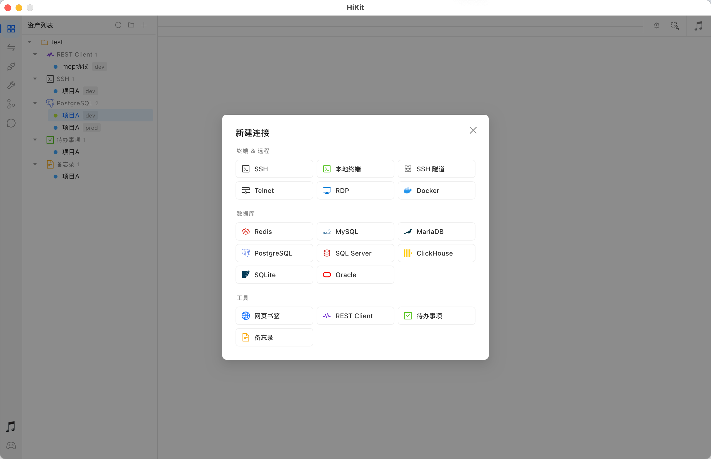

### SSH / SFTP

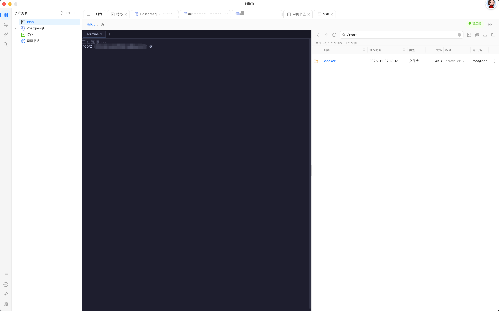

### SSH 포트 포워딩

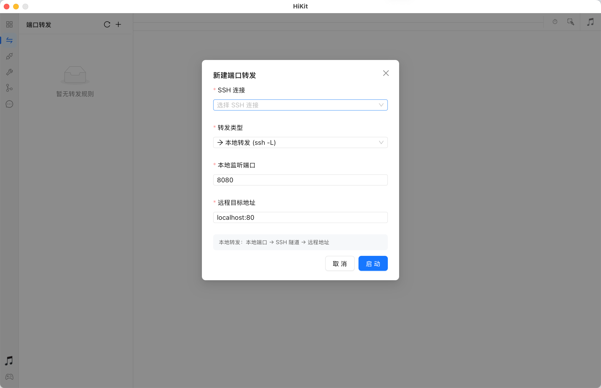

### 데이터베이스 관리

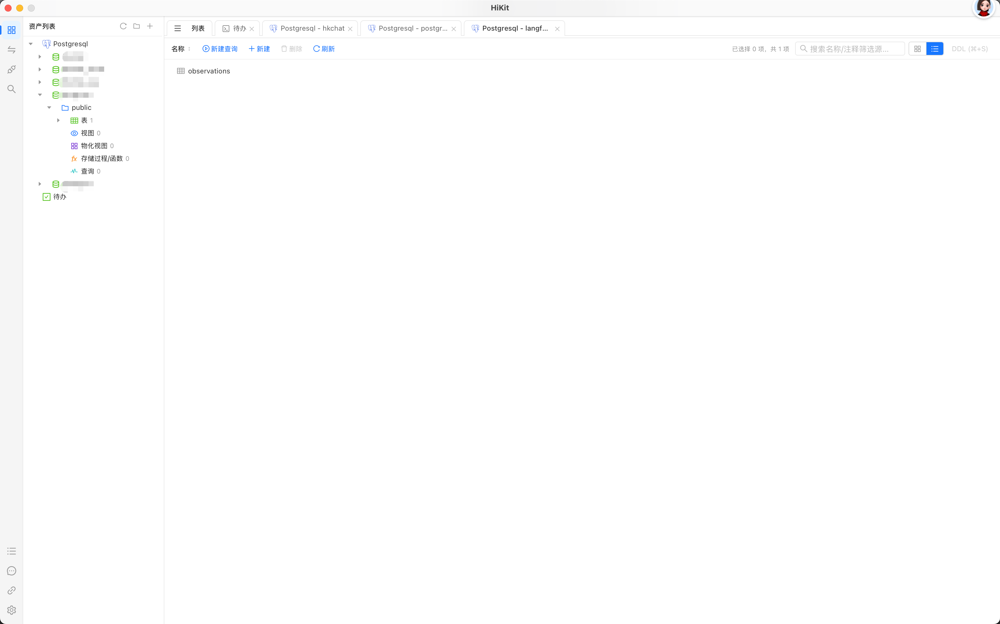
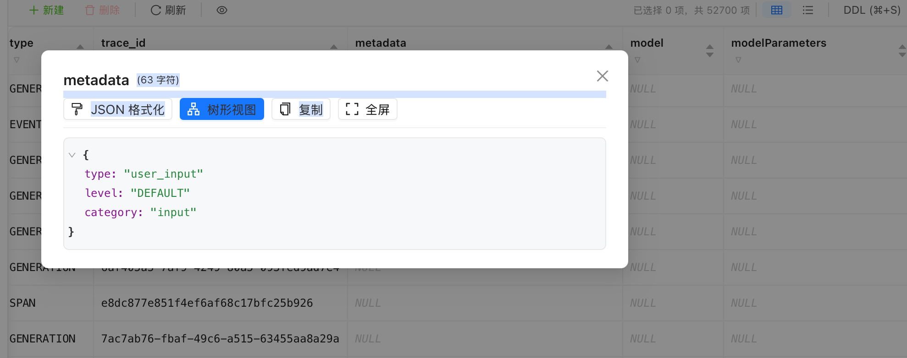

### REST Client

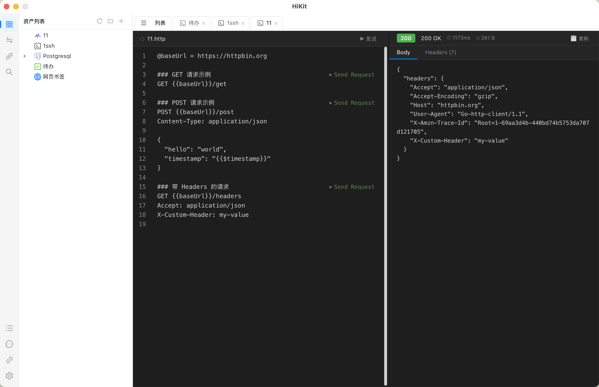

### 웹 프록시

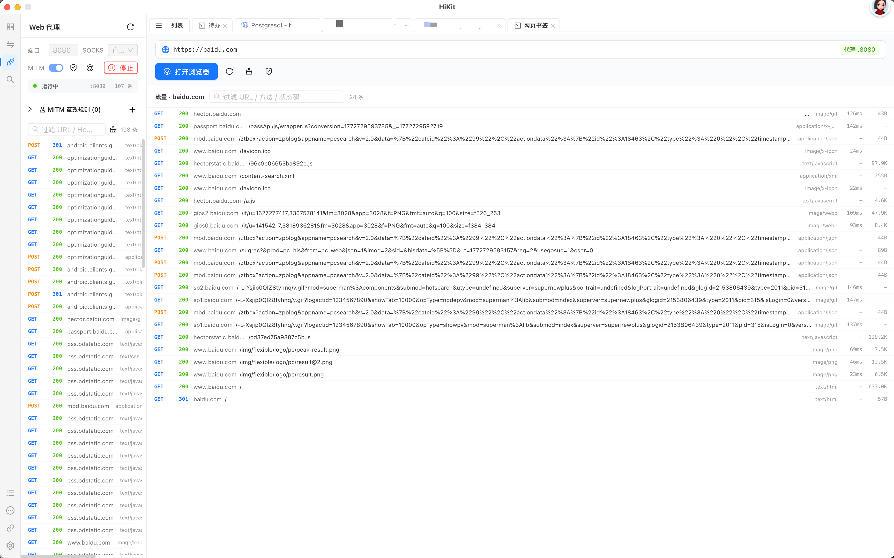

### 툴박스

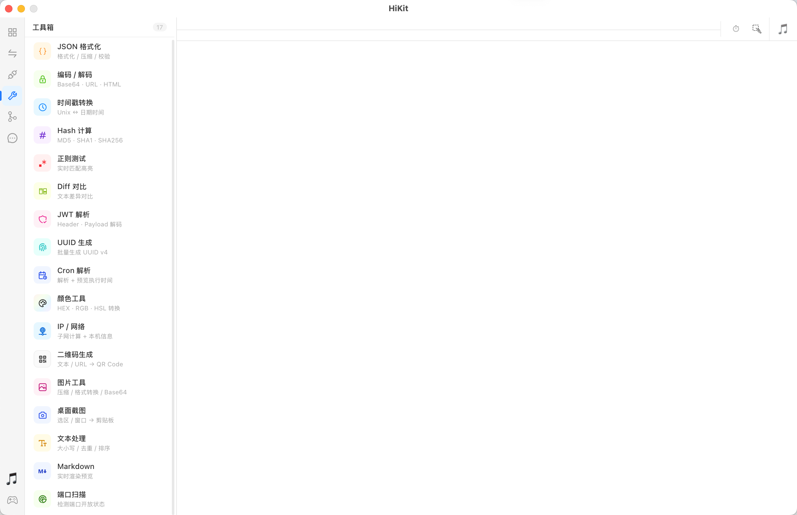

### Git 관리

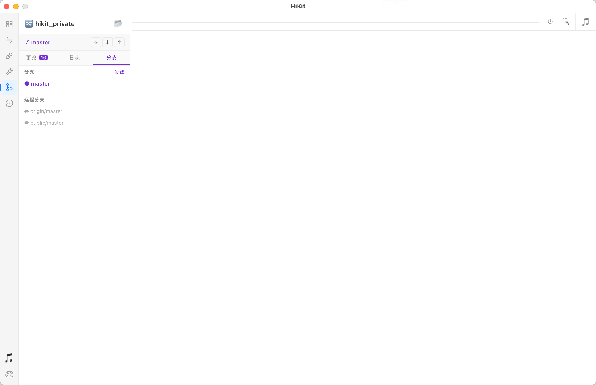

### 할 일 목록 & 메모

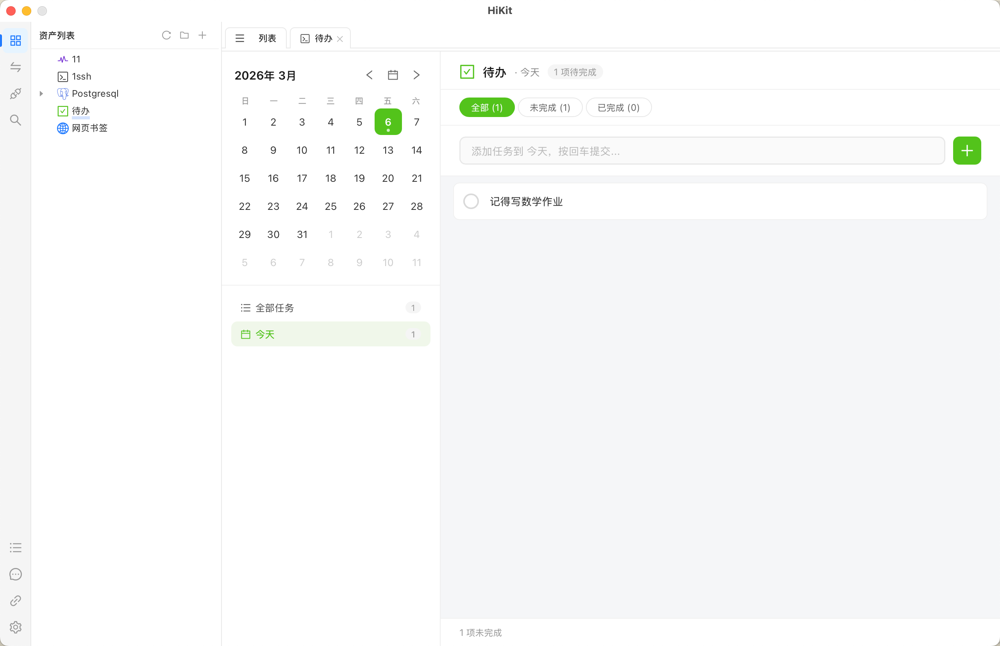
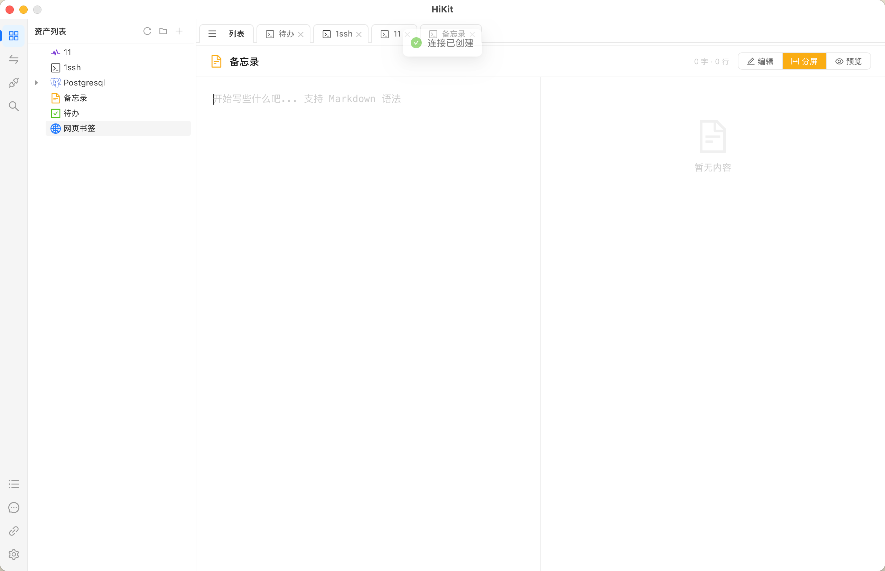

### 음악 플레이어 & 게임 에뮬레이터

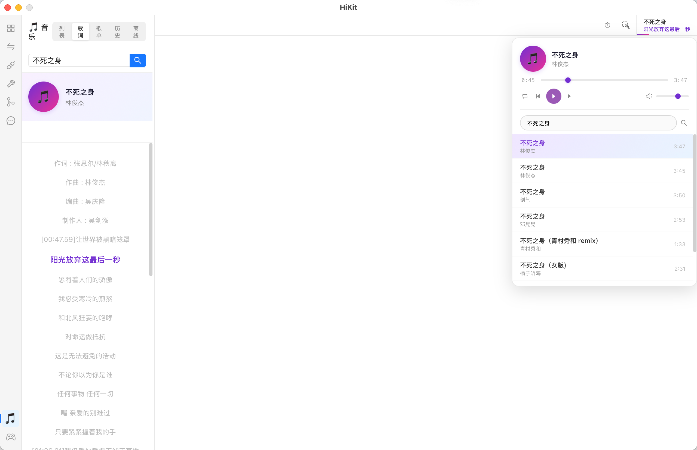
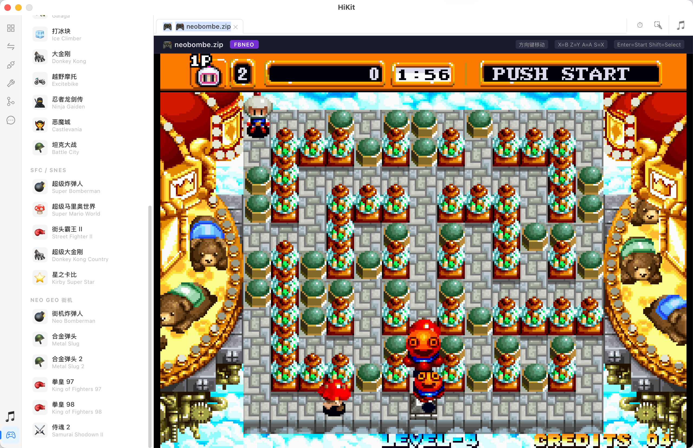

---

## 개발

```bash
wails dev    # 개발 모드
wails build  # 빌드
```

---

## 기술 스택

| 레이어 | 기술 |
|--------|------|
| **백엔드** | Go + Wails v2 |
| **프론트엔드** | React + TypeScript + Ant Design |
| **데이터베이스** | SQLite |
| **터미널** | xterm.js |
